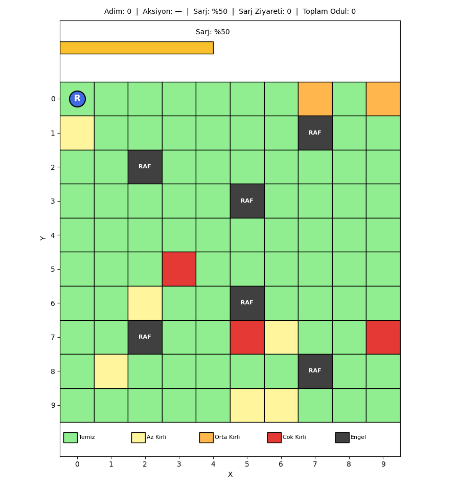

# Otonom Mağaza Temizlik Robotu

Bu proje, pekiştirmeli öğrenme (reinforcement learning) dersi kapsamında yaptığım bir Q-Learning uygulamasıdır. Senaryo şu: gece kapanan bir mağazada bir temizlik robotu var, sabaha kadar zemini temizleyip kendi kendine şarj olması gerekiyor. Robot bunu klasik bir kural seti ile değil, deneme-yanılma yoluyla, aldığı ödül ve cezalardan öğrenerek yapacak.

Amaç hem RL'in temel kavramlarını (state, action, reward, Q-Table, epsilon-greedy, exploration vs exploitation) somut bir örnek üzerinde pekiştirmek hem de eğitilmiş bir ajanın rastgele bir ajana göre ne kadar farklı davrandığını sayısal olarak göstermek.

## Çalıştırma

```bash
pip install -r requirements.txt
python main.py
```

Eğitim normal bir laptopta yaklaşık 1-2 dakika sürüyor. Bittiğinde `outputs/` klasörünün altına şunlar düşüyor:

- `outputs/q_table.npy` → eğitilmiş Q-Table
- `outputs/plots/` → eğitim grafikleri (ödül, başarı oranı, bölüm uzunluğu, Q vs Random karşılaştırması)
- `outputs/gifs/final_episode.gif` → eğitilen ajanın bir bölümünün animasyonu

Konsola da kısa bir özet yazdırılıyor (ortalama ödül, başarı oranı, vb.).

## Problem Tanımı

Mağaza ortamı 5x5'lik bir grid olarak modellendi. Her hücrenin bir kirlilik seviyesi var:

- **0** → temiz
- **1** → kirli (örneğin reyon arası)
- **2** → çok kirli (örneğin kasa önü)

Grid üzerinde sabit pozisyonlarda iki adet raf var (engel olarak kullanılıyor, robot bunlara çarpamaz) ve bir adet şarj istasyonu var. Robot başlangıçta tam dolu pille (100) işe başlıyor.

Robotun hedefi:

1. Tüm kirli hücreleri temizlemek
2. Çok kirli hücrelere öncelik vermek (oradaki kir daha değerli)
3. Şarjı bitmeden istasyona dönmek
4. Bunları minimum adımda yapmak

Bu hedefler birbirleriyle çatışıyor. Mesela en yakın kirli hücreye gitmek her zaman doğru değil, çünkü uzakta daha kirli bir hücre olabilir. Ya da kirli bir hücreyi temizlemeye odaklanırken şarj kritiğe düşebilir. Bu çatışmaları kural yazarak çözmek hem zor hem de bakımı zor kod ortaya çıkarıyor. RL'in burada parlak yanı şu: ajan ödül sinyaline bakarak bu dengeleri kendi keşfediyor.

### Grid Yerleşimi

```text
Sütun:    0     1     2     3     4
       +-----+-----+-----+-----+-----+
  0    |  *  |     |     |  K  |     |
       +-----+-----+-----+-----+-----+
  1    |     |     |  R  |     |  K  |
       +-----+-----+-----+-----+-----+
  2    |     |     | KK  |     |     |
       +-----+-----+-----+-----+-----+
  3    |     |  R  |     |  K  |     |
       +-----+-----+-----+-----+-----+
  4    |  K  |     |     |     | KK  |
       +-----+-----+-----+-----+-----+

  *   : Şarj istasyonu
  R   : Raf (engel)
  K   : Kirli hücre (level 1)
  KK  : Çok kirli hücre (level 2)
```

Toplamda 6 temizlenecek hücre var: 4 kirli + 2 çok kirli. Robotun bütün bu hücreleri temizlemesi durumunda bölüm "başarılı" sayılıyor ve büyük bir terminal ödül alıyor.

## Aksiyonlar

Ajanın 6 farklı aksiyonu var:

| ID | Aksiyon | Açıklama |
| --- | --- | --- |
| 0 | Yukarı | Y ekseninde -1 hareket |
| 1 | Aşağı | Y ekseninde +1 hareket |
| 2 | Sol | X ekseninde -1 hareket |
| 3 | Sağ | X ekseninde +1 hareket |
| 4 | Temizle | Bulunduğu hücreyi temizler |
| 5 | Şarja Git | Eğer istasyondaysa pili doldurur |

Burada özellikle dikkat edilmesi gereken bir nokta var: **"Şarja Git" aksiyonu robotu istasyona ışınlamıyor.** Sadece robot zaten istasyondaysa pili dolduruyor, başka yerdeyse hiçbir şey olmuyor (ve -2 ceza yiyor, çünkü gereksiz aksiyon). Bu kararı bilinçli verdim çünkü robotun "ne zaman dönmem lazım, hangi yoldan dönmem lazım" sorularını kendisinin öğrenmesini istedim. Aksi takdirde sorun trivial hâle geliyor.

## State Tasarımı

State tasarımı bu projede en çok düşündüğüm konuydu çünkü Q-Learning'in tablolu (tabular) versiyonu state sayısına çok hassas.

İlk olarak şunu denemek istedim: state'e robotun konumu + tüm grid'in kirlilik haritası + şarj. Ama hesabı yaptığımda durdum:

```text
Robot konumu: 25
Şarj: 100
Grid kirlilik haritası: 3^25 ≈ 8.5 x 10^11

Toplam state ≈ 25 * 100 * 8.5e11 ≈ 2 x 10^15
```

Bu hâliyle Q-Table'ı belleğe sığdırmak imkânsız. Bu probleme literatürde "**state space explosion**" deniyor. Tablolu Q-Learning'in sınırlarından biri ve genelde Deep Q-Network gibi function approximation yöntemlerine geçişin sebebi.

Ben tablolu yaklaşımı kullanmak istediğim için state'i ciddi şekilde küçülttüm:

```python
state = (robot_x, robot_y, sarj_bandi, mevcut_hucre_kirliligi)
```

| Bileşen | Aralık | Boyut |
| --- | --- | --- |
| `robot_x` | 0..4 | 5 |
| `robot_y` | 0..4 | 5 |
| `sarj_bandi` | 0..3 | 4 |
| `mevcut_hucre_kirliligi` | 0..2 | 3 |

Toplam state sayısı: **5 × 5 × 4 × 3 = 300**

Q-Table boyutu: **300 × 6 = 1800** hücre. Belleğe rahatça sığıyor ve 3000 episode içinde yakınsıyor.

### Bu Tasarımın Bedeli

State'te tüm grid'in kirlilik haritası olmadığı için robot, hangi hücrelerin hâlâ kirli olduğunu doğrudan "görmüyor". Sadece bulunduğu hücrenin kirliliğini biliyor. Bu yüzden robot bir nevi "kör" geziyor: tüm kirli hücreleri bulana kadar bazen gereksiz dolaşıyor. Buna rağmen %95 başarı oranına ulaştı, çünkü grid küçük ve robot deneye deneye haritayı zihnen çıkarıyor diyebiliriz (aslında öğrenilen şey "şu pozisyonda şu yöne git" politikası).

Eğer grid daha büyük olsaydı bu tasarım yetmezdi. Ya hangi hücrelerin temiz olduğunu encode eden daha zengin bir state'e geçmek ya da DQN gibi function approximation kullanmak gerekirdi.

## Şarj Seviyesi Discretization

Şarj 0-100 arasında bir tamsayı olarak takip ediliyor. Ama bunu state'e olduğu gibi koymak istemedim, çünkü 100 farklı değer state space'i 100 katına çıkarırdı. Onun yerine 4 banda ayırdım:

| Şarj Değeri | Band ID | Anlamı |
| --- | --- | --- |
| 0-15 | 0 | Kritik |
| 16-40 | 1 | Düşük |
| 41-75 | 2 | Orta |
| 76-100 | 3 | Tam |

Bantları seçerken şuna dikkat ettim: kritik bandı yeterince geniş tuttum ki ajan "şarja gitmem lazım" sinyalini erken alabilsin. Eğer kritiği 0-5 yapsaydım ajan istasyona dönerken yolda şarjı bitebilirdi.

## Reward Fonksiyonu

Reward tasarımı muhtemelen bu projedeki en uğraştırıcı kısımdı. Birkaç iterasyon sonra son hâli şöyle oldu:

| Olay | Ödül | Neden |
| --- | --- | --- |
| Çok kirli hücreyi temizleme | **+20** | Öncelik sinyali |
| Kirli hücreyi temizleme | **+10** | Pozitif görev sinyali |
| Temiz hücreye temizle aksiyonu | **-2** | Boş yere temizlemeye çalışmasını engellemek |
| Her adım (idle) | **-1** | Hızlı bitirmeyi teşvik |
| Duvar / engel çarpması | **-5** | Engellerden kaçınma |
| İstasyondayken düşük pille şarja gitme | **+5** | Doğru zamanda şarja girme |
| İstasyondayken dolu pille şarja gitme | **-2** | Gereksiz şarj girişimini engelle |
| Şarjın hareket sırasında sıfırlanması | **-100** | Pil bitmesi felaket |
| Tüm kirli hücrelerin temizlenmesi (terminal) | **+100** | Görev başarısı |

### Reward Tasarımında Aldığım Dersler

İlk denememde **çok kirli ile kirli arasındaki farkı koymadım** (ikisine de +10 verdim). Sonuç: ajan iki seviyeyi ayırt etmedi, en yakın kirli hücreye gidiyordu. +20 / +10 farkını koyduğumda davranış değişti, ajan görsel olarak da çok kirli hücrelere yöneldiği belli olmaya başladı.

İkinci olarak **her adıma -1 cezası** koymak çok önemli. Bunu koymadığımda ajan görevini tamamlasa bile gereksiz dolaşıyordu, çünkü "yaparsam +10, durursam 0" mantığıyla hareket etmenin maliyeti yoktu. -1 koyduktan sonra her adım pahalı hâle geldi ve ajan en kısa yolu bulmaya başladı.

Üçüncü olarak **şarjın bitmesine -100 vermek** kritik. Daha küçük cezalar verdiğimde ajan riski göze alıyordu. -100 felaket sinyalini net bir şekilde verdi.

Genel kural olarak şunu öğrendim: reward fonksiyonu, davranışın "ne olmasını istediğinizi" değil, "ne kadar istediğinizi" anlatır. Yani sadece pozitif/negatif değil, ödüllerin **birbirine göre büyüklüğü** önemli.

## Q-Learning Algoritması

Klasik Q-Learning Bellman güncellemesi kullanıldı:

```python
Q(s, a) = Q(s, a) + alpha * (r + gamma * max(Q(s', a')) - Q(s, a))
```

Burada:

- `Q(s, a)` → mevcut state'te o aksiyonun tahmini değeri
- `alpha` → learning rate (yeni bilgiye ne kadar açığız)
- `gamma` → discount factor (gelecekteki ödüller bugünkü kararlarda ne kadar ağırlıklı)
- `r` → bu adımda alınan ödül
- `max(Q(s', a'))` → bir sonraki state'teki en iyi aksiyonun tahmini değeri

Sezgisel olarak: ajan "şu anda yaptığım aksiyonun değerini, aldığım anlık ödül + gelecekte ulaşacağım state'in en iyi aksiyonunun değeri" üzerinden günceller. Bu sayede uzun vadeli planlama mümkün olur.

### Hiperparametreler

| Parametre | Değer | Notum |
| --- | --- | --- |
| Learning rate (α) | 0.1 | İlk denememde 0.3 idi, Q değerleri çok osilasyon yaptı, 0.1 stabil sonuç verdi |
| Discount factor (γ) | 0.95 | Yeterince uzak vadeli planlama için yüksek tuttum |
| Episode sayısı | 3000 | 1500 civarı plato, kalanı doğrulama |
| Max adım / bölüm | 200 | Sonsuz dolanmayı engellemek için |
| Başlangıç şarjı | 100 | Tam dolu başlangıç |
| Random seed | 42 | Tekrarlanabilirlik |

## Epsilon-Greedy Exploration

Ajanın "öğrendiğini kullanmak" (exploitation) ile "yeni şeyler denemek" (exploration) arasında dengelemesi gerekiyor. Bunun için epsilon-greedy stratejisi kullandım:

- Her adımda ε olasılıkla rastgele bir aksiyon seçilir (exploration)
- (1 - ε) olasılıkla Q-Table'a göre en iyi aksiyon seçilir (exploitation)

Epsilon zamanla azalıyor:

- **Başlangıçta** ε = 1.0 (ajan tamamen rastgele hareket eder, çevreyi tanır)
- **Her bölüm sonunda** ε ← ε × 0.995 (yavaşça azalır)
- **Minimum** ε = 0.01 (öğrendikten sonra bile küçük bir keşif payı kalır)

Decay oranını 0.995 seçmemin sebebi: 3000 episode içinde ε'nin yaklaşık 600. bölümde 0.05 civarına düşmesi. Yani ilk yarıda yoğun keşif, ikinci yarıda yoğun sömürü.

## Eğitim Süreci

`main.py` çalıştırıldığında şu adımlar sırayla yürütülür:

1. Ortam ve ajan başlatılır (Q-Table sıfır matris olarak oluşturulur)
2. 3000 bölüm boyunca eğitim yapılır:
   - Her bölüm başında ortam sıfırlanır (kirlilik haritası, şarj, robot pozisyonu)
   - Bölüm bitene kadar (terminal state ya da 200 adım) ajan adım adım hareket eder
   - Her adımda Q-Table güncellenir
   - Bölüm sonunda epsilon azaltılır
3. Eğitilmiş Q-Table `outputs/q_table.npy` olarak kaydedilir
4. Eğitilen ajan ε=0 ile 100 bölüm boyunca değerlendirilir
5. Aynı ortamda rastgele aksiyon seçen bir ajan da 100 bölüm değerlendirilir
6. Grafikler üretilir
7. Final bir bölüm GIF olarak kaydedilir

## Sonuçlar

3000 bölüm sonunda elde edilen sonuçlar oldukça tatmin ediciydi.

### Ödül Grafiği


İlk yaklaşık 300 bölüm ajan negatif ödül alıyor, çünkü çoğunlukla rastgele hareket ediyor ve şarjı bitiyor / engellere çarpıyor / boş hücreyi temizlemeye çalışıyor. 500. bölüm civarında hızlı bir yükseliş başlıyor (Q-Table'ın yapısı oturmaya başlıyor). 1000. bölümden sonra eğri stabil bir plato hâline geliyor.

| Ölçüm | Değer |
| --- | --- |
| İlk 100 bölüm ortalama ödülü | ≈ -217 |
| Son 100 bölüm ortalama ödülü | ≈ +138 |
| İyileşme | ≈ 355 puan |

Bu, ajanın ortamı tamamen anlamsız buldukları noktadan, görevi bilinçli yapan bir politikaya geçtiğini gösteriyor.

### Başarı Oranı


Bir bölümün "başarılı" sayılması için tüm kirli hücrelerin temizlenmesi gerekiyor.

| Aralık | Başarı Oranı |
| --- | --- |
| İlk 100 bölüm | %2 |
| 500-600 bölüm aralığı | %75-90 |
| Son 100 bölüm | %95 |

Yani ilk 100 bölümün 100'ünden sadece 2'sinde tüm hücreler temizlenebilirken, son 100 bölümde 95'inde temizlenebiliyor.

### Bölüm Uzunluğu


Bölüm başına ortalama adım sayısı eğitim ilerledikçe düşüyor. Bu sadece "görevi yapma" değil, "verimli yapmayı" da öğrendiğini gösteriyor.

| Aralık | Ortalama Adım |
| --- | --- |
| İlk 100 bölüm | ≈ 95 |
| Son 100 bölüm | ≈ 43 |

### Q-Learning vs Random Karşılaştırması

Eğitim bittikten sonra ajan ε=0 ile (yani sadece öğrendiği politikayla) 100 bölüm boyunca değerlendirildi. Aynı ortamda her adımda rastgele aksiyon seçen bir ajan da 100 bölüm boyunca koşturuldu.


| Metrik | Q-Learning | Random |
| --- | --- | --- |
| Ortalama ödül | +156 | -280 |
| Ortalama adım | 30 | 104 |
| Başarı oranı | %100 | %0 |

Random ajan **100 bölümün hiçbirinde** görevi tamamlayamadı. Q-Learning ajanı ise 100/100 başarıyla bitirdi. Aralarında ortalama ödül farkı yaklaşık **436 puan**.

Bu karşılaştırma bence projenin en güzel kısmı. Çünkü RL'in ne yaptığını teorik olarak anlatmak yerine "rastgele hareket eden ajanın 0 başarısına karşı, eğitilen ajanın 100 başarısı" diyerek somut bir kanıt sunabiliyoruz.

## Görselleştirme

Eğitim bittikten sonra eğitilmiş Q-Table yüklenip ajan ε=0 ile bir bölüm boyunca koşturuluyor. Her adım bir GIF frame'ine çevriliyor.



GIF içerisinde şunlar gözlemlenebilir:

- **Mavi daire**: Robotun anlık konumu
- **Hücre renkleri**: Yeşil = temiz, sarı = kirli, kırmızı = çok kirli
- **Koyu gri kareler**: Raflar (engeller)
- **Sarı yıldız**: Şarj istasyonu
- **Renkli bar**: Şarj seviyesi (yeşilden kırmızıya doğru azalır)
- **Üst yazı**: Seçilen aksiyon ve toplam ödül

Bu bölümde ajan görevi 30 adımda bitirdi ve toplam +156 ödül topladı.

## Gözlemler

Eğitim sonunda ajanın aşağıdaki davranışları öğrendiğini gözlemledim:

- **Çok kirli hücrelere öncelik**: Ajan +20 ödüllü hücreleri görsel olarak da hedefliyor, yolu üzerinde olmasalar bile onlara doğru yöneliyor
- **Engellerden kaçınma**: İlk 200 bölümden sonra rafa çarpma davranışı neredeyse yok
- **Verimli yol**: Bölüm başına ortalama adım 95'ten 30'a düştü
- **Şarj yönetimi**: Şarj belirli bir eşiğe (genelde Düşük bandına) düşünce istasyona dönme eğilimi var
- **Gereksiz aksiyonlardan kaçınma**: Temiz hücreyi tekrar temizlemeye çalışma, dolu pille şarja gitme gibi davranışlar zamanla yok oluyor

Beklemediğim bir şey: ajan bazı bölümlerde aslında şarjı kullanmadan da görevi tamamlayabilirken yine de istasyona uğruyor. Sanırım `sarj_bandi` state'in bir parçası olduğu için "şarjı tam tutmak" politikanın bir parçası hâline gelmiş. Bu beklenmedik bir overfitting değil ama ajanın state'inin dışındaki bilgileri kullanamadığını da hatırlatıyor.

## Karşılaştığım Zorluklar

Birkaç noktada zorlandım, kayıt için yazıyorum:

1. **Reward dengesini bulmak**: İlk versiyonum çok kötü davranışlar üretiyordu. Ajan ya sürekli aynı yerde duruyordu ya rastgele dolaşıyordu. Reward'ları ayarlamak iteratif bir süreç oldu.

2. **State'i ne kadar küçültmek**: Çok küçültürsem ajan bilgi kaybeder, çok büyütürsem Q-Table sığmaz. 300 state'lik karar ortayı buldu ama "doğru" yapı bu mu hâlâ tam emin değilim.

3. **Convergence sabırsızlığı**: İlk denememde 500 episode koşturmuştum ve "öğrenmiyor" diye düşündüm. 3000'e çıkardığımda farkın ne kadar büyük olduğunu gördüm. RL'de sabırlı olmak gerekiyor.

4. **Görselleştirme**: Matplotlib ile her adımı bir frame'e çevirmek ve bunları ImageIO ile GIF'e dönüştürmek beklediğimden uzun sürdü. Şarj barı, aksiyon yazısı vs. eklenirken kaç farklı versiyon yazdım bilmiyorum.

## Proje Yapısı

```text
otonom-temizlik-robotu/
│
├── main.py                  # Ana giriş noktası
├── requirements.txt
├── README.md
│
├── src/
│   ├── __init__.py
│   ├── environment.py       # Grid, kirlilik, şarj, step/reset mantığı
│   ├── agent.py             # Q-Table, epsilon-greedy, update kuralı
│   ├── trainer.py           # Eğitim ve değerlendirme döngüleri
│   └── visualizer.py        # Grafikler ve GIF üretimi
│
└── outputs/
    ├── q_table.npy
    ├── plots/
    │   ├── training_rewards.png
    │   ├── episode_lengths.png
    │   ├── success_rate.png
    │   └── q_vs_random.png
    └── gifs/
        └── final_episode.gif
```

Modülleri ayırırken şu mantığı izledim: ortam ile ajan birbirini bilmemeli (sadece state ve action arayüzünden konuşmalı), trainer her ikisini de kullanmalı, visualizer trainer'ın çıktısı üstüne çalışmalı. Bu sayede ajanı veya ortamı değiştirmek için diğerlerine dokunmaya gerek kalmıyor.

## Sınırlamalar

- **Grid boyutu**: 5x5 küçük bir ortam. Gerçek bir mağazayı temsil etmiyor, sadece kavramsal bir prototip.
- **Statik kirlilik**: Bölüm başında dağılım sabit. Gerçek hayatta kirlilik gün içinde dinamik olarak birikir.
- **Tek robot**: Multi-agent durumlar (birden fazla robotun koordinasyonu) bu projede yok.
- **Tabular Q-Learning**: Daha büyük gridlerde state space patlar, function approximation gerekir.
- **Şarj 4 banda indirgenmiş**: Daha hassas şarj kararları için bu yetmeyebilir.

## Geliştirilebilecek Yönler

İleride bu projeye eklenebilecek şeyler:

- **DQN'e geçiş**: State'e tüm grid kirlilik haritası dahil edilebilir, neural network ile öğrenilebilir
- **Dinamik kirlilik**: Her bölümde kirlilik dağılımı rastgelelenebilir, robot bilinen pozisyonlara değil "kirlilik desenlerine" göre öğrenir
- **Multi-agent**: Birden fazla robot, görev paylaşımı, çakışma yönetimi
- **Gerçek mağaza haritası**: 5x5 yerine reel ölçekli, gerçek raf yerleşimleri olan bir grid
- **Sensör gürültüsü**: Robotun gözlemine gürültü ekleyerek POMDP modellemesi
- **Daha gelişmiş RL algoritmaları**: SARSA, Double Q-Learning, ya da policy-based yöntemler (REINFORCE, PPO)

## Kullanılan Teknolojiler

- **Python 3.9+**
- **NumPy** → Q-Table ve sayısal hesaplamalar
- **Matplotlib** → grafikler ve grid render
- **ImageIO** → GIF üretimi

Hepsi `requirements.txt` içinde, `pip install -r requirements.txt` ile kuruluyor.

## Sonuç

Bu projede pekiştirmeli öğrenmenin pratik bir uygulamasını yapmaya çalıştım. Q-Learning gibi basit bir algoritmanın bile, doğru state ve reward tasarımı ile karmaşık görünen kararları (kirlilik önceliği, şarj yönetimi, verimli yol planlama) öğrenebildiğini gördüm.

En çok şunu öğrendim: RL'de algoritma kadar **problem formülasyonu** önemli. State'i nasıl tanımladığım, reward'ları nasıl şekillendirdiğim, ajanı ne kadar süre eğittiğim - bunların hepsi sonucu doğrudan etkiliyor. Algoritma aynı kalsa bile bu seçimler farklı olduğunda ortaya çıkan davranış tamamen değişiyor.

Random ajanın 0 başarı, eğitilen ajanın %100 başarı oranı - bu fark hem RL'in gücünü hem de doğru tasarımın önemini gösteriyor diye düşünüyorum.
