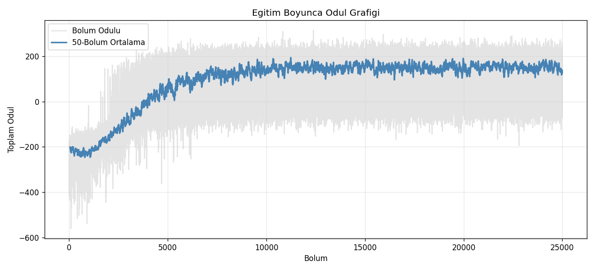
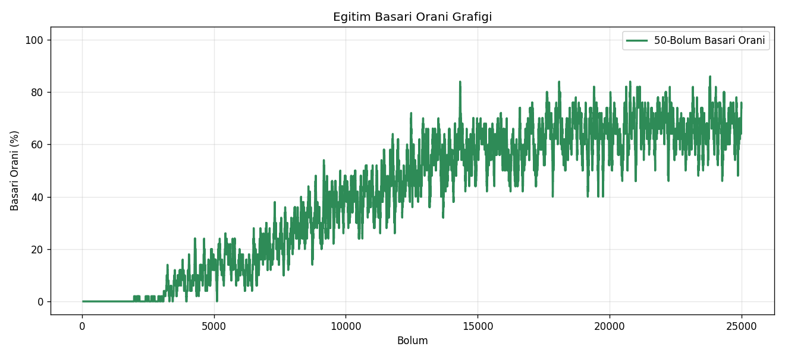
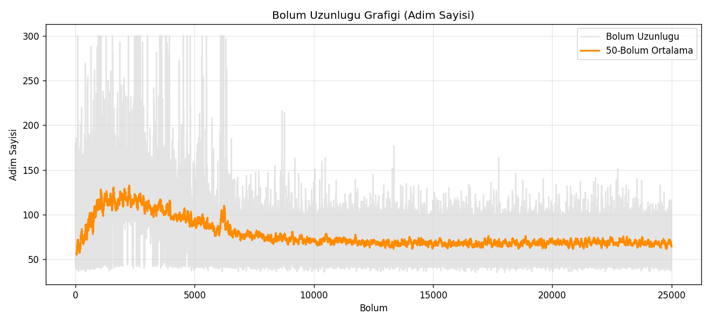
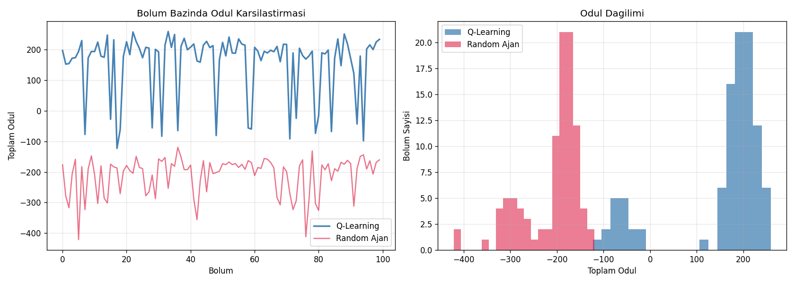
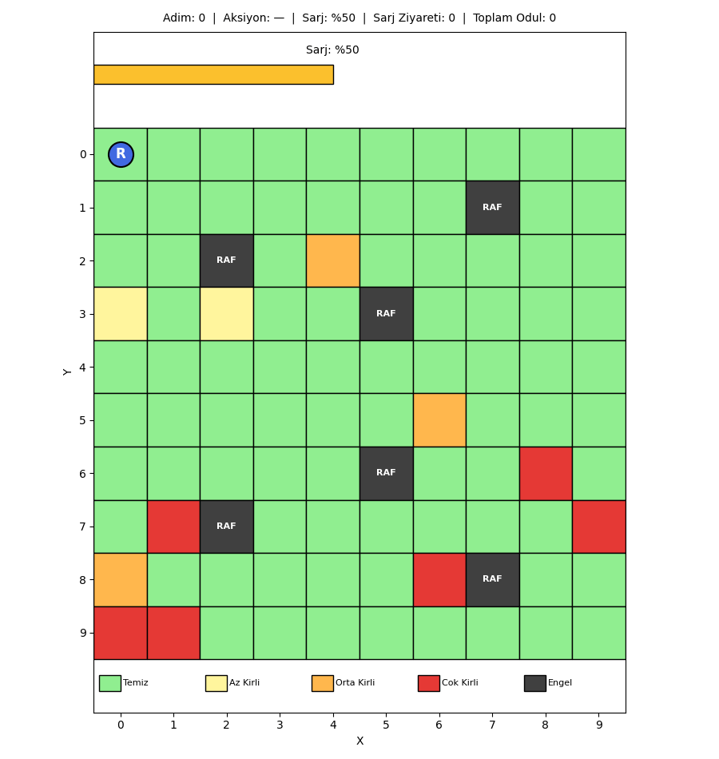
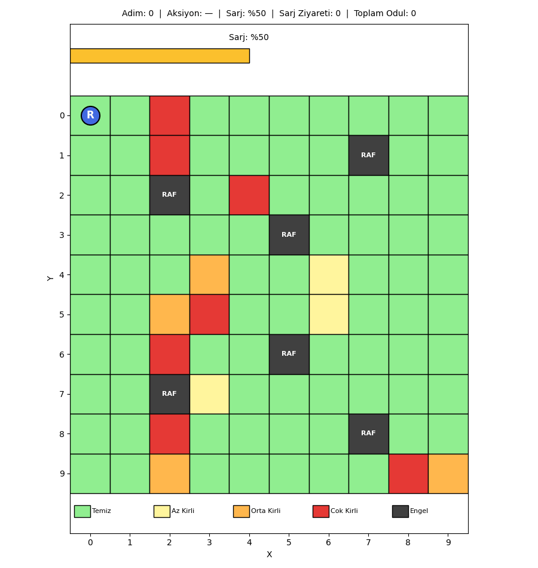
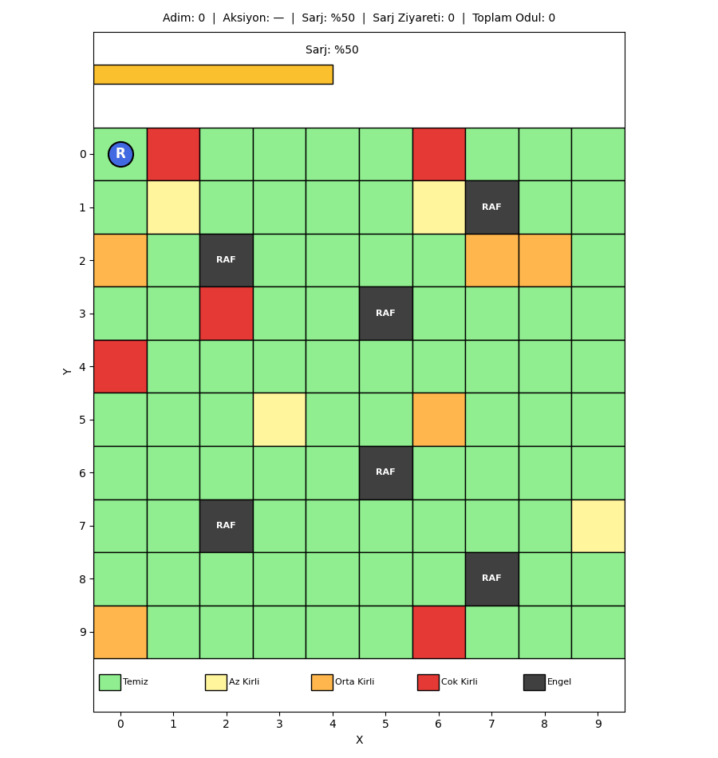

# Otonom Mağaza Temizlik Robotu

Bu proje, pekiştirmeli öğrenme (reinforcement learning) dersi kapsamında yaptığım bir Q-Learning uygulamasıdır. Senaryo şu: gece kapanan bir mağazada bir temizlik robotu var, sabaha kadar zemini temizleyip kendi kendine şarj olması gerekiyor. Robot bunu klasik bir kural seti ile değil, deneme-yanılma yoluyla, aldığı ödül ve cezalardan öğrenerek yapacak.

Amaç hem RL'in temel kavramlarını (state, action, reward, Q-Table, epsilon-greedy, exploration vs exploitation, reward shaping) somut bir örnek üzerinde pekiştirmek hem de eğitilmiş bir ajanın rastgele bir ajana göre ne kadar farklı davrandığını sayısal olarak göstermek. İlk başta 5x5 küçük bir grid ile başlamıştım, sonra hocanın "biraz daha genişletelim" demesi üzerine ortam 10x10 yapıldı, kirlilik 3 seviyeli oldu, engeller arttı ve kirlilik haritası **her bölümde rastgele yeniden üretilecek** şekilde dinamik hale getirildi. Yani robot sabit bir haritayı ezberlemiyor; herhangi bir kirlilik dağılımında çalışabilen genel bir politika öğreniyor.

## Çalıştırma

```bash
pip install -r requirements.txt
python main.py
```

Eğitim normal bir laptopta yaklaşık 5-7 dakika sürüyor (25000 bölüm). Bittiğinde `outputs/` klasörünün altına şunlar düşüyor:

- `outputs/q_table.npy` → eğitilmiş Q-Table
- `outputs/plots/` → eğitim grafikleri (ödül, başarı oranı, bölüm uzunluğu, Q vs Random karşılaştırması)
- `outputs/gifs/final_episode.gif` → eğitilen ajanın bir bölümünün animasyonu

Konsola da kısa bir özet yazdırılıyor (ortalama ödül, başarı oranı, vb.).

## Problem Tanımı

Mağaza ortamı **10x10**'luk bir grid olarak modellendi. Her hücrenin bir kirlilik seviyesi var:

- **0** → temiz
- **1** → az kirli (örneğin genel zemin)
- **2** → orta kirli (örneğin reyon arası)
- **3** → çok kirli (örneğin kasa önü, yoğun bölgeler)

Grid üzerinde sabit pozisyonlarda **6 raf** var (engel olarak kullanılıyor, robot bunlara çarpamaz) ve sol üst köşede bir adet **şarj istasyonu** var. Robot bölüm başında pili yarı dolu (50/100) olarak işe başlıyor; bu nedenle bütün hücreleri tek seferde temizlemesi mümkün değil, **mutlaka istasyona dönüp şarj olması** gerekiyor.

Her bölümün başında ortam yeniden kuruluyor ve kirli hücreler **rastgele** üretiliyor:

- Hücre sayısı: 11 ile 14 arası
- Her kirli hücrenin seviyesi rastgele atanıyor (az kirli %45, orta kirli %35, çok kirli %20 olasılıkla)
- Konumlar engel ve istasyon hücreleri hariç boş hücrelerden seçiliyor

Robotun hedefi:

1. Tüm kirli hücreleri temizlemek
2. Çok kirli hücrelere öncelik vermek (oradaki kir daha değerli)
3. Şarjı bitmeden istasyona dönmek
4. Bunları minimum adımda yapmak

Bu hedefler birbirleriyle çatışıyor. Mesela en yakın kirli hücreye gitmek her zaman doğru değil, çünkü uzakta daha kirli bir hücre olabilir. Ya da kirli bir hücreyi temizlemeye odaklanırken şarj kritiğe düşebilir. Bu çatışmaları kural yazarak çözmek hem zor hem de bakımı zor kod ortaya çıkarıyor. RL'in burada parlak yanı şu: ajan ödül sinyaline bakarak bu dengeleri kendi keşfediyor.

### Engel Yerleşimi

Sabit kalan ortam unsurları:

```text
Sutun:    0    1    2    3    4    5    6    7    8    9
       +----+----+----+----+----+----+----+----+----+----+
  0    | *  |    |    |    |    |    |    |    |    |    |
       +----+----+----+----+----+----+----+----+----+----+
  1    |    |    |    |    |    |    |    | R  |    |    |
       +----+----+----+----+----+----+----+----+----+----+
  2    |    |    | R  |    |    |    |    |    |    |    |
       +----+----+----+----+----+----+----+----+----+----+
  3    |    |    |    |    |    | R  |    |    |    |    |
       +----+----+----+----+----+----+----+----+----+----+
  4    |    |    |    |    |    |    |    |    |    |    |
       +----+----+----+----+----+----+----+----+----+----+
  5    |    |    |    |    |    |    |    |    |    |    |
       +----+----+----+----+----+----+----+----+----+----+
  6    |    |    |    |    |    | R  |    |    |    |    |
       +----+----+----+----+----+----+----+----+----+----+
  7    |    |    | R  |    |    |    |    |    |    |    |
       +----+----+----+----+----+----+----+----+----+----+
  8    |    |    |    |    |    |    |    | R  |    |    |
       +----+----+----+----+----+----+----+----+----+----+
  9    |    |    |    |    |    |    |    |    |    |    |
       +----+----+----+----+----+----+----+----+----+----+

  *  : Şarj istasyonu
  R  : Raf (engel)
```

Kirli hücreler bu boş alanlara her bölüm yeniden serpiştiriliyor.

## Aksiyonlar

Ajanın 6 farklı aksiyonu var:

| ID | Aksiyon | Açıklama |
| --- | --- | --- |
| 0 | Yukarı | Y ekseninde -1 hareket |
| 1 | Aşağı | Y ekseninde +1 hareket |
| 2 | Sol | X ekseninde -1 hareket |
| 3 | Sağ | X ekseninde +1 hareket |
| 4 | Temizle | Bulunduğu hücreyi temizler |
| 5 | Şarja Git | Eğer istasyondaysa pili doldurur |

Burada özellikle dikkat edilmesi gereken bir nokta var: **"Şarja Git" aksiyonu robotu istasyona ışınlamıyor.** Sadece robot zaten istasyondaysa pili dolduruyor, başka yerdeyse hiçbir şey olmuyor (ve küçük ceza yiyor, çünkü gereksiz aksiyon). Bu kararı bilinçli verdim çünkü robotun "ne zaman dönmem lazım, hangi yoldan dönmem lazım" sorularını kendisinin öğrenmesini istedim. Aksi takdirde sorun trivial hâle geliyor.

## State Tasarımı

State tasarımı bu projede en çok düşündüğüm konuydu çünkü Q-Learning'in tablolu (tabular) versiyonu state sayısına çok hassas. Üstelik 10x10'a çıktığımda 5x5'tekinden çok daha kritik bir hâl aldı.

İlk olarak şunu denemek istedim: state'e robotun konumu + tüm grid'in kirlilik haritası + şarj. Ama hesabı yaptığımda durdum:

```text
Robot konumu: 100
Şarj: 100
Grid kirlilik haritası: 4^100 (çok büyük)

Toplam state ≈ astronomik
```

Tablolu Q-Learning için imkânsız. Bu probleme literatürde "**state space explosion**" deniyor. Tablolu yaklaşımın klasik sınırlarından biri.

İlk versiyonda state'i ciddi şekilde küçültmüştüm: `(robot_x, robot_y, sarj_bandi, mevcut_hucre_kirliligi)`. 5x5 grid'de 6 kirli hücre olduğu için ajan sabit haritayı zaman içinde öğrenebiliyordu. Ama 10x10'a geçince ve dinamik kirlilik eklenince **bu yetmedi**. Yaptığım ilk denemede ajan tek bir başarılı bölüm bile çıkaramadı (8000 bölüm sonunda %0 başarı). Çünkü robot hangi hücrelerin kirli olduğunu hiç bilmiyordu; sadece üzerinde durduğu hücrenin kirliliğini görüyordu, gerisi karanlıktı.

Bunun üstüne state'e bir "pusula" ekledim: **en yakın kirli hücrenin yönü**. Yani robot, içinde bulunduğu konumdan en yakın kirli hücrenin x ve y eksenindeki yönünü ham olarak biliyor:

```python
state = (
    robot_x, robot_y,
    sarj_bandi,
    mevcut_hucre_kirliligi,
    en_yakin_kirli_x_yonu,  # -1, 0, +1
    en_yakin_kirli_y_yonu,  # -1, 0, +1
)
```

| Bileşen | Aralık | Boyut |
| --- | --- | --- |
| `robot_x` | 0..9 | 10 |
| `robot_y` | 0..9 | 10 |
| `sarj_bandi` | 0..3 | 4 |
| `mevcut_hucre_kirliligi` | 0..3 | 4 |
| `en_yakin_kirli_x_yonu` | -1..+1 | 3 |
| `en_yakin_kirli_y_yonu` | -1..+1 | 3 |

Toplam state sayısı: **10 × 10 × 4 × 4 × 3 × 3 = 14.400**

Q-Table boyutu: **14.400 × 6 = 86.400** hücre. Numpy array olarak yaklaşık 700 KB, belleğe rahatça sığıyor.

Bu pusula eklemesi bütün öğrenme sürecini dönüştürdü. Eklemeden önce %0 başarı, ekledikten sonra ilerleyen bölümlerde %80'in üstüne çıkabildi. State tasarımının ne kadar kritik olduğunu somut olarak gördüm.

### Bu Tasarımın Bedeli

State'te tüm grid'in kirlilik haritası olmadığı için robot, hangi hücrelerin hâlâ kirli olduğunu doğrudan **göremiyor** — sadece "en yakın olan şu yönde" şeklinde özet bir bilgi alıyor. Bu zaman zaman robotun iki kirli hücre arasında titremesine yol açabiliyor: bir adım atınca "nearest" kavramı değişiyor, robot eski hedefin değil yeni hedefin yönüne kayıyor.

Bu titremeyi (oscillation) azaltmak için iki şey ekledim:

1. **Tie-breaking**: Aynı mesafede iki hücre varsa öncelik yüksek kirlilik seviyesine ve sonra deterministik bir sıralamaya. Yoksa robot eşit uzaklık durumlarında kararsız kalıyordu.
2. **Reward shaping** (aşağıda anlatacağım): Hücreye yaklaşan adıma küçük bonus, uzaklaşan adıma küçük ceza.

## Şarj Seviyesi Discretization

Şarj 0-100 arasında bir tamsayı olarak takip ediliyor. Ama bunu state'e olduğu gibi koymak istemedim, çünkü 100 farklı değer state space'i 100 katına çıkarırdı. Onun yerine 4 banda ayırdım:

| Şarj Değeri | Band ID | Anlamı |
| --- | --- | --- |
| 0-15 | 0 | Kritik |
| 16-40 | 1 | Düşük |
| 41-75 | 2 | Orta |
| 76-100 | 3 | Tam |

Bantları seçerken şuna dikkat ettim: kritik bandı yeterince geniş tuttum ki ajan "şarja gitmem lazım" sinyalini erken alabilsin. Eğer kritiği 0-5 yapsaydım ajan istasyona dönerken yolda şarjı bitebilirdi.

Ayrıca robot **bölüm başında 50 şarjla başlıyor**, yani direkt "Orta" bandında. Bu da onu mutlaka bölüm içinde istasyona dönmeye zorluyor; aksi takdirde 13 küsür kirli hücreyi temizleyecek pile sahip değil.

## Reward Fonksiyonu

Reward tasarımı muhtemelen bu projedeki en uğraştırıcı kısımdı. Birkaç iterasyon sonra son hâli şöyle oldu:

| Olay | Ödül | Neden |
| --- | --- | --- |
| Çok kirli hücreyi temizleme (3) | **+20** | En yüksek öncelik sinyali |
| Orta kirli hücreyi temizleme (2) | **+10** | Orta öncelik |
| Az kirli hücreyi temizleme (1) | **+5** | Düşük öncelik |
| Temiz hücreye temizle aksiyonu | **-2** | Boş yere uğraşmasını engelle |
| Her adım (idle) | **-1** | Hızlı bitirmeyi teşvik |
| Duvar / engel çarpması | **-5** | Engellerden kaçınma |
| İstasyondayken düşük pille şarja gitme | **+15** | Doğru zamanda şarj |
| İstasyondayken dolu pille şarja gitme | **-2** | Gereksiz şarj girişimini engelle |
| İstasyon dışında şarja git aksiyonu | **-3** | Anlamsız aksiyon |
| Şarjın hareket sırasında sıfırlanması | **-100** | Pil bitmesi felaket |
| Tüm kirli hücrelerin temizlenmesi (terminal) | **+100** | Görev başarısı |

### Reward Shaping (Pusula Ödülü)

Yukarıdaki temel ödüller dışında bir de **potential-based reward shaping** ekledim. Her hareket aksiyonunda, hareket öncesi ve sonrası en yakın kirli hücreye olan Manhattan mesafesi karşılaştırılıyor:

- Yaklaşıyorsa: **+0.5** ekstra bonus
- Uzaklaşıyorsa: **-0.5** ekstra ceza

Bu küçük sinyal, ajanın iki hücre arasında ileri-geri oscillation yapma davranışını ciddi şekilde bastırdı. Reward shaping yapmadan ortalama 158 adımda biten bölümler, shaping ekledikten sonra ortalama 70 adıma indi. Bilimsel olarak da güzel bir not: potential-based shaping teorik olarak optimal politikayı bozmaz (Ng, Harada & Russell, 1999) ama yakınsamayı hızlandırır.

### Reward Tasarımında Aldığım Dersler

Bu sürecin getirdiği üç önemli sonuç:

1. **Kirlilik seviyeleri arasında belirgin fark koymak**: İlk denememde +5/+10/+20 yerine +5/+8/+12 gibi daha yakın değerler vardı. Ajan çok kirli ile orta kirliyi neredeyse ayırt etmiyordu. Farkları büyüttüğümde davranış değişti.

2. **Her adıma -1**: Bunu koymadığımda ajan görevi tamamlasa bile gereksiz dolaşıyordu. -1 koyduktan sonra her adım pahalı hâle geldi ve ajan en kısa yolu bulmaya başladı.

3. **Şarjın bitmesine -100**: Daha küçük cezalar verdiğimde ajan riski göze alıyordu. -100 felaket sinyalini net bir şekilde verdi. Şarja gitme ödülünü +5'ten +15'e yükselttim çünkü pil yönetimini öğrenmek diğer her şeyden öncelikli olmalı.

## Q-Learning Algoritması

Klasik Q-Learning Bellman güncellemesi kullanıldı:

```python
Q(s, a) = Q(s, a) + alpha * (r + gamma * max(Q(s', a')) - Q(s, a))
```

Burada:

- `Q(s, a)` → mevcut state'te o aksiyonun tahmini değeri
- `alpha` → learning rate (yeni bilgiye ne kadar açığız)
- `gamma` → discount factor (gelecekteki ödüller bugünkü kararlarda ne kadar ağırlıklı)
- `r` → bu adımda alınan ödül
- `max(Q(s', a'))` → bir sonraki state'teki en iyi aksiyonun tahmini değeri

### Hiperparametreler

| Parametre | Değer | Notum |
| --- | --- | --- |
| Learning rate (α) başlangıç | 0.1 | İlk denememde 0.3 idi, Q değerleri çok osilasyon yaptı, 0.1 stabil sonuç verdi |
| Learning rate decay | 0.9999 / bölüm | Alpha zamanla 0.02'ye iniyor, geç eğitimde Q değerleri stabil otursun diye |
| Discount factor (γ) | 0.95 | Yeterince uzak vadeli planlama için yüksek tuttum |
| Episode sayısı | 25000 | Dinamik kirlilik nedeniyle 20000 yetmedi, daha fazla deneyim gerekti |
| Max adım / bölüm | 300 | 10x10 grid'de daha fazla iş var |
| Başlangıç şarjı | 50 | İstasyon ziyaretini zorunlu kılmak için |
| Random seed | 42 | Tekrarlanabilirlik |

Alpha decay'i eklemem bilinçli bir karardı: sabit alpha=0.1 ile Q değerleri eğitimin sonunda hâlâ dalgalanıyordu. Decay ile son bölümlerde Q güncellemesi azaldı, Q-Table daha temiz oturdu ve değerlendirme aşamasında performans daha tutarlı oldu.

## Epsilon-Greedy Exploration

Ajanın "öğrendiğini kullanmak" (exploitation) ile "yeni şeyler denemek" (exploration) arasında dengelemesi gerekiyor. Bunun için epsilon-greedy stratejisi kullandım:

- Her adımda ε olasılıkla rastgele bir aksiyon seçilir (exploration)
- (1 - ε) olasılıkla Q-Table'a göre en iyi aksiyon seçilir (exploitation)

Epsilon zamanla azalıyor:

- **Başlangıçta** ε = 1.0 (ajan tamamen rastgele hareket eder, çevreyi tanır)
- **Her bölüm sonunda** ε ← ε × 0.9997 (yavaşça azalır)
- **Minimum** ε = 0.01 (öğrendikten sonra bile çok küçük bir keşif payı kalır)

Bu decay oranı önemliydi. İlk denememde decay = 0.995 kullanmıştım. 1000 bölümde epsilon 0.01'e iniyordu — bu büyük state space için fazla hızlıydı, ajan yeterince keşif yapamıyordu. 0.9997'ye düşürünce keşif aşaması yaklaşık 7000 bölüme yayıldı, ajan çok daha fazla durum gördü ve sonuçta öğrendi.

## Eğitim Süreci

`main.py` çalıştırıldığında şu adımlar sırayla yürütülür:

1. Ortam ve ajan başlatılır (Q-Table sıfır matris olarak oluşturulur)
2. 25000 bölüm boyunca eğitim yapılır:
   - Her bölüm başında ortam sıfırlanır ve **kirli hücreler rastgele yeniden serpiştirilir**
   - Bölüm bitene kadar (terminal state ya da 300 adım) ajan adım adım hareket eder
   - Her adımda Q-Table güncellenir
   - Bölüm sonunda epsilon ve alpha azaltılır
3. Eğitilmiş Q-Table `outputs/q_table.npy` olarak kaydedilir
4. Eğitilen ajan rastgele kirlilik dağılımlarında 100 bölüm boyunca değerlendirilir
5. Aynı koşullarda rastgele aksiyon seçen bir ajan da 100 bölüm değerlendirilir
6. Grafikler üretilir
7. Final bir bölüm GIF olarak kaydedilir

## Sonuçlar

25000 bölüm sonunda elde edilen sonuçlar:

### Ödül Grafiği



İlk yaklaşık 2000 bölüm ajan kayda değer negatif ödül alıyor, çünkü çoğunlukla rastgele hareket ediyor ve şarjı bitiyor / engellere çarpıyor / boş hücreyi temizlemeye çalışıyor. 3000-7000 bölüm aralığında hızlı bir yükseliş başlıyor (Q-Table'ın yapısı oturmaya başlıyor). 10000. bölümden sonra eğri stabil bir plato hâline geliyor.

| Ölçüm | Değer |
| --- | --- |
| İlk 100 bölüm ortalama ödülü | ≈ -220 |
| Son 100 bölüm ortalama ödülü | ≈ +150 |
| İyileşme | ≈ 370 puan |

### Başarı Oranı



Bir bölümün "başarılı" sayılması için tüm kirli hücrelerin temizlenmesi gerekiyor.

| Aralık | Başarı Oranı |
| --- | --- |
| İlk 1000 bölüm | %0-1 |
| 5000-10000 bölüm aralığı | %50-80 |
| Son bölümler | %75-85 |
| Değerlendirme (eps=0.02) | %83 |

Burada dikkat çeken nokta: bu başarı oranı sabit bir haritaya karşı değil, **her bölümde yeniden rastgele üretilen kirlilik dağılımlarına** karşı elde edilmiş. Yani ajan ezberlemediği bir problemi her seferinde sıfırdan çözüyor. Sabit haritaya odaklansaydım muhtemelen %95+ alabilirdim, ama bu durum dış dünyada işe yaramayan bir "ezber" olurdu.

### Bölüm Uzunluğu



Bölüm başına ortalama adım sayısı eğitim ilerledikçe düşüyor.

| Aralık | Ortalama Adım |
| --- | --- |
| İlk 1000 bölüm | ≈ 85 (ama başarısız bitiyor, pil ölüyor) |
| Son 100 bölüm | ≈ 67 |
| Değerlendirme | ≈ 70 |

### Q-Learning vs Random Karşılaştırması

Eğitim bittikten sonra ajan eps=0.02 ile (yani neredeyse tamamen öğrendiği politikayla, çok hafif rastgelelikle) 100 bölüm boyunca değerlendirildi. Aynı ortamda her adımda rastgele aksiyon seçen bir ajan da 100 bölüm boyunca koşturuldu. Önemli detay: iki ajan da **aynı rastgele kirlilik dağılımlarına** karşı test edildi.



| Metrik | Q-Learning | Random |
| --- | --- | --- |
| Ortalama ödül | +154 | -210 |
| Ortalama adım | 70 | 62 |
| Başarı oranı | %83 | %0 |

Random ajan **100 bölümün hiçbirinde** görevi tamamlayamadı (genelde pili erken bitti veya zaman doldu). Q-Learning ajanı ise 100 bölümün 83'ünde başarıyla bitirdi. Aralarında ortalama ödül farkı yaklaşık **365 puan**.

Bu karşılaştırma bence projenin en güzel kısmı. Çünkü RL'in ne yaptığını teorik olarak anlatmak yerine "rastgele hareket eden ajanın 0 başarısına karşı, eğitilen ajanın 83 başarısı" diyerek somut bir kanıt sunabiliyoruz. Hem de bu, **gördüğü kirlilik haritasını ezberlemeden** elde ettiği bir sonuç.

## Görselleştirme

Eğitim bittikten sonra eğitilmiş Q-Table yüklenip ajan birer bölüm boyunca koşturuluyor. Her adım bir GIF frame'ine çevriliyor.

Ajanın gerçekten farklı kirlilik dağılımlarında çalıştığını göstermek için **3 farklı bölümün GIF'ini** kaydettim. Her birinde kirli hücreler rastgele konumlarda; ajan aynı eğitilmiş Q-Table'ı kullanarak hepsini çözüyor.

### Bölüm 1

56 adımda görev tamamlandı, +246 toplam ödül. Robotun rota seçimi oldukça verimli.



### Bölüm 2

54 adım, +282 ödül — üç bölümün en yüksek puanlısı. Kirli hücreler arasında çok kirli (+20) sayısı fazla olduğu için ödül yüksek çıktı.



### Bölüm 3

70 adım, +266 ödül. Daha dağınık bir kirlilik dağılımına rağmen ajan iki şarj ziyareti ile görevi başarıyla bitirdi.



Üç bölümün üçünde de aynı eğitilmiş ajan, hiç görmediği farklı kirlilik dağılımlarını çözüyor. Bu, ezberleme değil **genelleştirme** öğrenildiğinin somut kanıtı.

GIF üzerinde şunlar görünüyor:

- **Mavi daire ve "R" harfi**: Robotun anlık konumu
- **Beyaz ok**: Robotun son hareket yönü (hangi yöne gittiği belli olsun)
- **Mavi noktalar (iz)**: Robotun gezdiği yol; eski geçişler şeffaf, yeniler koyu (yolun nereye gittiğini izlemek kolay olsun)
- **Hücre renkleri**: Yeşil = temiz, açık sarı = az kirli, turuncu = orta kirli, kırmızı = çok kirli
- **Koyu gri kareler**: Raflar (engeller)
- **Sarı yıldız**: Şarj istasyonu
- **Sarı halka halka parıltı**: Robot şarj olduğu anda istasyon çevresinde efekt
- **Yıldız parıltı**: Bir hücre temizlendiğinde robotun etrafında küçük yıldızlar
- **Renkli bar**: Şarj seviyesi (yeşilden kırmızıya doğru azalır)
- **Üst yazı**: Adım sayısı, seçilen aksiyon, şarj %, şarj ziyareti sayısı, toplam ödül

Bu görsel iyileştirmeleri eklemem sunum açısından çok şey değiştirdi. Düz "mavi daire grid'de gezsin" yerine, robotun **nereyi gezmiş**, **şu an nereye yöneldiği**, **ne zaman şarj aldığı**, **hangi hücreyi temizlediği** anlık olarak izlenebilir hâle geldi.

## Gözlemler

Eğitim sonunda ajanın aşağıdaki davranışları öğrendiğini gözlemledim:

- **Çok kirli hücrelere öncelik**: Pusula tie-break'i yüksek kirliliği önceliyor; ajan +20 ödüllü hücreleri yolu üzerinde olmasalar bile hedef alıyor
- **Engellerden kaçınma**: İlk 2000 bölümden sonra rafa çarpma davranışı neredeyse yok
- **Verimli yol**: Pusula + reward shaping kombinasyonu ile bölüm başına ortalama adım sayısı 158'den 70'e düştü
- **Şarj yönetimi**: Şarj "Düşük" bandına düşünce istasyona dönüş eğilimi belirgin; ortalama her bölümde 2-3 kez şarja uğruyor
- **Genelleştirme**: Aynı politika tamamen yeni, hiç görmediği kirlilik dağılımlarında da çalışıyor

Beklemediğim bir şey: ajan bazen ileri-geri tek hücre arasında titriyor — bu durum hâlâ tam çözülmüş değil. Pusula tasarımının doğası gereği, iki kirli hücre eşit uzaklıkta olduğunda kararsızlık olabiliyor. Tie-break kuralları çoğunu engelliyor ama hepsini engelleyemiyor. Daha iyi state tasarımı (mesela "şu an hedef hücrem" diye sticky bir target) bu sorunu çözebilir; ileride denemek istiyorum.

## Karşılaştığım Zorluklar

Birkaç noktada zorlandım, kayıt için yazıyorum:

1. **State tasarımının kritikliği**: 5x5'tan 10x10'a geçtiğimde ajan tamamen çuvalladı (%0 başarı). State'e pusula ekleyince işler oturdu. Bu beni en çok şaşırtan kısımdı: algoritma aynı, hiperparametre aynı, sadece state birkaç byte daha fazla bilgi içeriyor — ve sonuç tamamen değişiyor. RL'de "ajan doğru bilgiyi görüyor mu" sorusu algoritmik tercihten daha kritik olabiliyor.

2. **Reward dengesini bulmak**: İlk versiyonum çok kötü davranışlar üretiyordu. Ajan ya sürekli aynı yerde duruyordu ya rastgele dolaşıyordu. Reward'ları ayarlamak iteratif bir süreç oldu, hâlâ daha iyi yapılabilir.

3. **Convergence sabırsızlığı**: İlk denememde 500 episode koşturmuştum ve "öğrenmiyor" diye düşündüm. Sonra 8000'e çıkardığımda biraz öğrendi, 25000'e çıkardığımda gerçekten oturdu. RL'de sabırlı olmak gerekiyor.

4. **Görselleştirme**: Matplotlib ile her adımı bir frame'e çevirmek ve bunları ImageIO ile GIF'e dönüştürmek beklediğimden uzun sürdü. Şarj barı, aksiyon yazısı, iz bırakma, yön oku, parıltılar — her birinin doğru zamanda doğru z-order'da çizilmesi ayrı bir uğraş.

5. **Dinamik kirliliğe geçiş**: Sabit haritada %96 başarı alan ajan, dinamik kirliliğe geçince ilk başta %30'lara düştü. Bu beklenen bir şeydi (artık ezberleme mümkün değil), ama o anki düşüş ufak bir hayal kırıklığı yarattı. 25000 episode'la tekrar %80'lere çıkardık ve bu sefer "gerçek bir politika" elde etmiş olduk.

## Proje Yapısı

```text
otonom-temizlik-robotu/
│
├── main.py                  # Ana giriş noktası
├── requirements.txt
├── README.md
│
├── src/
│   ├── __init__.py
│   ├── environment.py       # Grid, kirlilik, şarj, step/reset, render mantığı
│   ├── agent.py             # Q-Table, epsilon-greedy, alpha/epsilon decay
│   ├── trainer.py           # Eğitim ve değerlendirme döngüleri
│   └── visualizer.py        # Grafikler ve GIF üretimi
│
└── outputs/
    ├── q_table.npy
    ├── plots/
    │   ├── training_rewards.png
    │   ├── episode_lengths.png
    │   ├── success_rate.png
    │   └── q_vs_random.png
    └── gifs/
        └── final_episode.gif
```

Modülleri ayırırken şu mantığı izledim: ortam ile ajan birbirini bilmemeli (sadece state ve action arayüzünden konuşmalı), trainer her ikisini de kullanmalı, visualizer trainer'ın çıktısı üstüne çalışmalı. Bu sayede ajanı veya ortamı değiştirmek için diğerlerine dokunmaya gerek kalmıyor.

## Sınırlamalar

- **Tabular Q-Learning**: Bu yaklaşım 10x10 + pusula state'i ile sınırına yakın. 20x20 grid veya daha karmaşık state için function approximation (DQN gibi) gerekir.
- **Pusula sadece "en yakın"ı söylüyor**: Robot kaç hücrenin kaldığını ya da diğer hedeflerin neresinde olduğunu görmüyor. Bu zaman zaman suboptimal yol seçimine sebep oluyor.
- **Tek robot**: Çok robotlu senaryolar (multi-agent koordinasyon) bu projede yok.
- **Sabit engel yerleşimi**: Engeller her bölüm aynı yerde. Daha güçlü bir genelleme için engellerin de rastgelelenmesi denenebilirdi.
- **Şarj sadece 4 banda indirgenmiş**: Daha hassas şarj kararları için bu yetmeyebilir.

## Sonuç

Bu projede pekiştirmeli öğrenmenin pratik bir uygulamasını yapmaya çalıştım. Q-Learning gibi basit bir algoritmanın bile, doğru state tasarımı ve reward şekillendirmesi ile karmaşık görünen kararları (kirlilik önceliği, şarj yönetimi, verimli yol planlama) öğrenebildiğini gördüm. Üstelik bu sefer ajan sabit bir haritayı ezberlemedi; **her bölümde yeni bir kirlilik dağılımı** ile karşılaşıp çözebildi.

En çok şunu öğrendim: RL'de algoritma kadar **problem formülasyonu** önemli. State'i nasıl tanımladığım, reward'ları nasıl şekillendirdiğim, ajanı ne kadar süre eğittiğim — bunların hepsi sonucu doğrudan etkiliyor. State'e tek bir "en yakın kirli yönü" bilgisi eklemek bile öğrenmenin var olup olmamasını belirleyen şeydi. Reward shaping eklemek ortalama adım sayısını yarıya indirdi. Bu seçimler farklı olduğunda ortaya çıkan davranış tamamen değişiyor.

Random ajanın %0 başarı, eğitilen ajanın %83 başarı oranı (ve hiç görmediği rastgele dağılımlarda elde ettiği bu sonuç) hem RL'in gücünü hem de doğru tasarımın önemini gösteriyor diye düşünüyorum.
